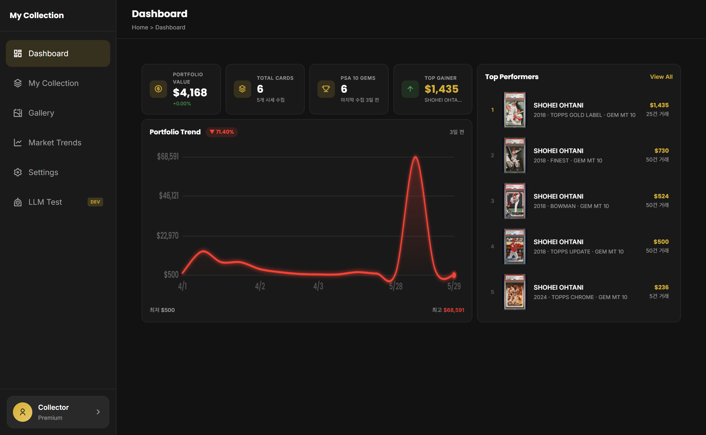
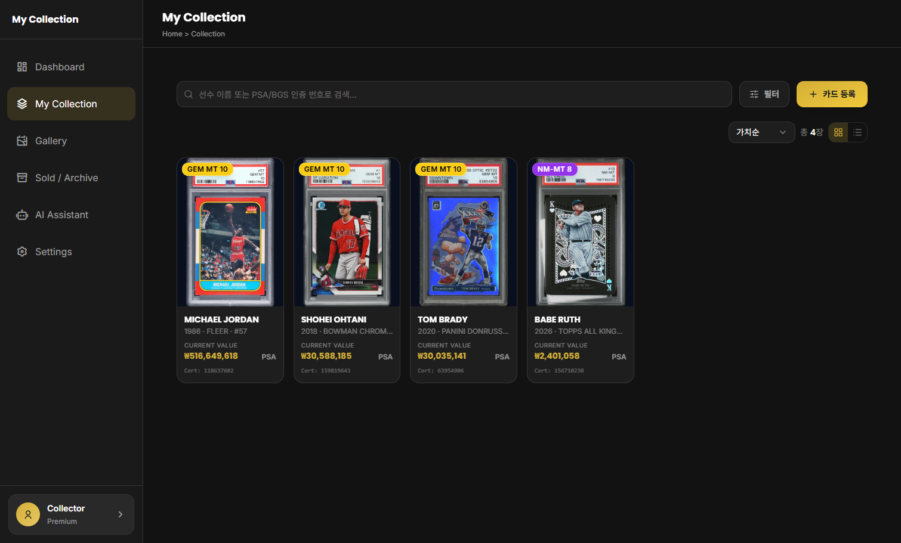
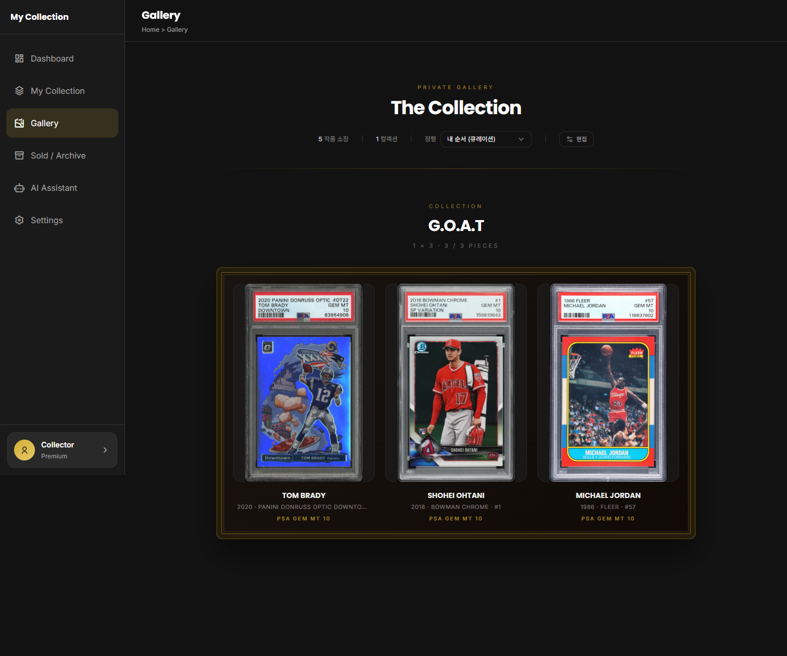

# My Collection

> **스포츠/트레이딩 카드 컬렉션 가치 추적·관리 웹 애플리케이션**
>
> [프론트엔드 라이브 데모](https://chyoung001.github.io/My_collection_/)

<br/>

## 프로젝트 소개

**My Collection**은 보유 중인 스포츠/트레이딩 카드를 체계적으로 관리하고 가치 변화를 추적하는 단일 사용자용 웹 서비스입니다.
**PSA Public API**로 카드 정보를 자동 등록하고, **PSA Estimate**와 **130point.com**(eBay 낙찰가 집계)을 스크래핑해 시세를 수집하며,
포트폴리오 총액·추이와 **미실현/실현 손익**을 한눈에 보여 줍니다.
카드를 프레임에 진열하는 **갤러리 큐레이션**과, 내 컬렉션 데이터에 근거해 답하는 **AI 어시스턴트**도 제공합니다.

<br/>

## 저장소 구성 (브랜치)

코드는 역할별로 브랜치를 나누어 관리합니다.

| 브랜치 | 내용 |
|--------|------|
| `main` | 프로젝트 개요(이 문서) |
| `backend` | Node.js / Express API 서버 (루트에 백엔드 코드) |
| `frontend` | React + Vite 프론트엔드 (`react/` 하위) |

각 브랜치의 `README`에 상세 설치·실행 방법이 있습니다.

<br/>

---

### 대시보드 (Dashboard)

> 포트폴리오 총액 · 보유 장 수 · PSA 10 젬 수 · 최고가 카드 등 요약 지표와
> 포트폴리오 가치 추이(고정 바스켓) 차트, 등급 분포 도넛, 미실현 손익, Top Performers를 한 화면에서 확인합니다.

<p align="center">
  
</p>

---

### 컬렉션 관리 (Collection)

> 보유 카드 목록과 검색(선수·인증번호), 등급사·등급·브랜드 필터, 카드 등록/삭제를 제공합니다.
> **자동 등록**(PSA Cert 번호로 정보·이미지 조회)과 **수동 등록**(RAW 카드 등) 두 가지를 지원합니다.
> PSA 인구수가 적은 카드는 **MasterPiece / Low Pop 희소 이펙트**로 강조됩니다.

<p align="center">
  
</p>

---

### 갤러리 (Gallery)

> 카드를 1×1 ~ 3×3 프레임 "섹션"에 진열하고 드래그로 정렬하는 큐레이션 전시 공간.
> 3D 틸트 효과와 라이트박스로 카드를 감상할 수 있습니다.

<p align="center">
  
</p>

---

### 시세 수집 (Market Snapshot)

> 카드 상세에서 **PSA Estimate**(우선)와 **130point.com**(폴백)을 ZenRows 헤드리스 브라우저로 조회해
> 최근 낙찰가·추정가를 수집합니다. 제목 매칭 · 적응형 기간 필터 · IQR 이상치 제거 후
> 평균/중앙값/대표가와 신뢰도를 산출하고, 시계열 스냅샷으로 저장해 가격 이력 차트를 그립니다.
> 일일 상한 · 레이트리밋 · 캐시 등 **비용 가드레일**로 외부 유료 호출을 통제합니다.

---

### 판매 / 실현 손익 (Sold & Realized P&L)

> 카드를 삭제하지 않고 **판매 처리**(판매가·메모)하면 보유 목록에서 빠져 **Sold / Archive**로 이동합니다.
> 보유분의 **미실현 손익**과 판매분의 **실현 손익**을 분리해 집계하여 실제 수익을 추적합니다.

---

### AI 컬렉션 어시스턴트 (AI Assistant)

> 내 컬렉션 데이터(가치 · 손익 · 등급 분포 · 시세 미수집 카드 등)를 서버에서 미리 집계해 근거로 제공하고,
> **2단계 모델 파이프라인**(추론 `kimi-k2.6` → 답변 `gemma4`)이 한국어로 답하는 채팅 · 인사이트 기능입니다.
> 모든 수치는 서버에서 선계산해 모델은 인용만 하도록 그라운딩합니다. (Ollama Cloud · SSE 스트리밍)

<br/>

## 기술 스택

### Backend (`backend` 브랜치)
- **Node.js (ES Modules) · Express 4**
- **PostgreSQL** (`pg`) — 부팅 시 자동 마이그레이션 (`utils/migrate.js`)
- **Cheerio** — 시세 HTML 파싱 · **ZenRows** — 헤드리스 스크래핑
- **Ollama** (네이티브 SDK) — AI 어시스턴트
- **Swagger UI** — `/docs` · **배포:** Railway

### Frontend (`frontend` 브랜치)
- **React 18 · Vite 5**
- **Tailwind CSS 3 · Radix UI** (shadcn 스타일) · **lucide-react**
- **Recharts** — 차트 · **React Router 6**

### 외부 연동
| 서비스 | 용도 |
|--------|------|
| **PSA Public API** | Cert 번호로 카드 정보·이미지·인구수 자동 조회 |
| **PSA Estimate · 130point.com** (ZenRows) | 추정가·최근 낙찰가 스크래핑 → 시세 수집 |
| **Ollama Cloud** | AI 컬렉션 어시스턴트 (kimi 추론 → gemma 답변) |

<br/>

## API 엔드포인트 (요약)

| Method | Endpoint | 설명 | 인증 |
|--------|----------|------|:----:|
| GET | `/api/cards` · `/api/cards/:id` | 카드 목록(`?status`) / 단건 | — |
| POST | `/api/cards` · `/api/cards/auto` | 수동 / PSA 자동 등록 | 🔒 |
| DELETE / PATCH | `/api/cards/:id` · `/:id/{sold,unsell,…}` | 삭제 / 판매·판매취소 / 필드 수정 | 🔒 |
| GET | `/api/dashboard/{summary,top-cards,top-gainer,realized}` | 대시보드 집계 | — |
| GET | `/api/snapshots/{summary,latest,portfolio-history}` · `/:id/history` | 시세·추이 조회 | — |
| POST | `/api/snapshots/:cardId/fetch` | 시세 수집(PSA/130point) | 🔒💰 |
| ALL | `/api/gallery/sections…` | 갤러리 큐레이션 | 쓰기 🔒 |
| GET/PATCH | `/api/preferences` | 환경설정 | 쓰기 🔒 |
| POST | `/api/assistant/{chat,stream,insights}` | AI 컬렉션 어시스턴트 | 🔒💰 |

🔒 토큰 필요 · 💰 외부 유료 호출. 전체 명세는 서버 실행 후 **`/docs`** 에서 확인할 수 있습니다.

### 보안
- 읽기(GET)는 공개, **쓰기·비용 호출은 공유 토큰(`API_TOKEN`, Bearer)** 으로 보호하고 IP 레이트리밋을 적용합니다.

<br/>

## 로컬 실행

### Backend (`backend` 브랜치)
```bash
npm install
cp .env.example .env        # DATABASE_URL 등 값 채우기 (Windows: copy)
npm start                   # 기본 포트 4000, 부팅 시 자동 마이그레이션
```
주요 환경변수: `DATABASE_URL`(필수) · `PSA_TOKEN` · `ZENROWS_API_KEY` · `OLLAMA_API_KEY` · `API_TOKEN`
(전체 목록은 `backend` 브랜치의 `.env.example` 참고)

### Frontend (`frontend` 브랜치)
```bash
cd react
npm install
npm run dev                 # http://localhost:5173
```
백엔드 주소는 `?apiBase=<url>` 쿼리 파라미터 또는 기본값 `http://localhost:4000`을 사용합니다.
